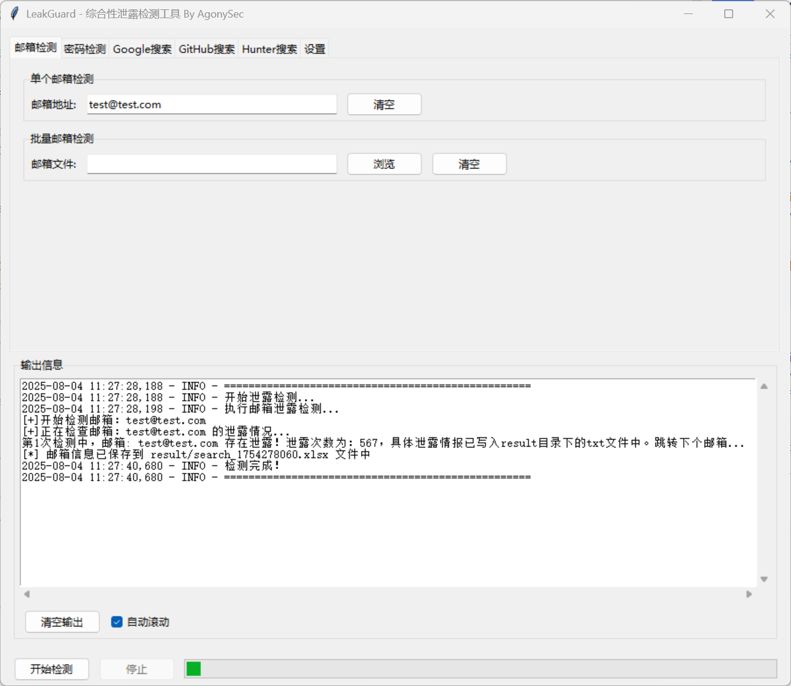

# LeakGuard - A Comprehensive Security Detection Tool


[中文][url-doczh]

## Introduction

A comprehensive security detection tool implemented in Python3, designed to detect whether emails and passwords appear in publicly leaked data. It also supports keyword searches on GitHub and Google, as well as email searches on Hunter.io. The tool provides both command-line interface (CLI) and graphical user interface (GUI) options.

## Features

- Email leak detection
- Password leak detection
- GitHub keyword detection (supports custom blacklist)
- Google keyword detection
- Hunter.io email detection
- Graphical User Interface (GUI)

### Feature Highlights

* **Batch Detection**: Capable of checking multiple emails or passwords for leaks simultaneously, supporting batch import from files
* **Multi-platform Search**: Supports searching for relevant information on GitHub, Google, and Hunter.io platforms
* **Dual Interface Operation**: Provides both command-line and graphical user interface options
* **Customizable Configuration**: Supports setting blacklist users and sensitive word filtering
* **Multiple Output Formats**: Supports outputting results in JSON and Excel (XLSX) formats
* **Python Implementation**: Written in Python, cross-platform compatible

## Usage

### Environment Preparation

Prerequisite: Use **`python3`** version to run and configure the [config.json](file://D:\WorkSpace\DevSecTools\LeakGuard\config\config.json) file:

To use GitHub keyword search, you need to configure the GitHub token:


### 1. Download the Project
```
git clone https://github.com/AgonySec/LeakGuard
```


### 2. Configure Dependencies

Ensure Python3 environment is installed. Then install the required dependencies via pip:

```
pip3 install -r requirements.txt
```


### 3. Run the Tool

LeakGuard provides two usage methods:

#### Command-Line Interface (CLI)

Run the script via command line and pass in the email or password list files you want to test:
```python

python main.py
usage: main.py [-h] [-e EMAIL] [-ef EMAIL_FILE] [-p PASSWORD] [-pf PASSFILE] [-o OUTPUT] [-c] [-bU BU] [-sW SW] [-google GOOGLE_SEARCH] [-ggf GOOGLE_FILE] [-github GITHUB_SEARCH] [-gtf GITHUB_FILE] [-hunter HUNTER_SEARCH] [-m {json,xlsx}]
LeakGuard - Comprehensive Email, Password Leak and Keyword Detection Tool By Agony
options: 
-h, --help show this help message and exit
-e EMAIL, --email EMAIL Enter the email address to test -ef EMAIL_FILE,
--email_file EMAIL_FILE Enter the file path containing multiple email addresses
-p PASSWORD, --password PASSWORD Enter the password to test
-pf PASSFILE, --passFile PASSFILE Enter the file path containing multiple passwords 
-o OUTPUT, --output OUTPUT Output filename without extension, defaults to Google_email_timestamp.json -c Information gathering mode -bU BU Set blacklist user file 
-sW SW Set sensitive words file 
-google GOOGLE_SEARCH,--google_search GOOGLE_SEARCH Specify email suffix to extract, e.g. @qq.com, extract specified domain emails from Google search
-ggf GOOGLE_FILE, --google_file GOOGLE_FILE Read email suffixes from txt file for Google search
-github GITHUB_SEARCH, --github_search GITHUB_SEARCH Specify keywords for GitHub search
-gtf GITHUB_FILE, --github_file GITHUB_FILE Specify keyword file for batch GitHub search
-hunter HUNTER_SEARCH, --hunter_search HUNTER_SEARCH Enter website domain for Hunter.io email search 
-m {json,xlsx}, --mode {json,xlsx} Specify output format, supports json or xlsx, defaults to xlsx
```
#### Graphical User Interface (GUI)

Run the GUI version:


```
python gui.py
```

The GUI version provides an intuitive interface with the following tabbed features:

1. **Email Detection**: Supports single email address detection or batch email file detection
2. **Password Detection**: Supports single password detection or batch password file detection
3. **Google Search**: Search for relevant information through email suffixes
4. **GitHub Search**: Search on GitHub through keywords
5. **Hunter Search**: Search for emails on Hunter.io through domain names
6. **Settings**: Configure output filename, format, and blacklist/sensitive word files

## Detection Explanation

### Email Leak Detection

Detects whether an email appears in known data breach events by querying the [haveibeenbreached.com](https://haveibeenbreached.com/) API.

### Password Leak Detection

Detects whether a password appears in known leaked password databases by querying the [haveibeenpwned.com](https://haveibeenpwned.com/) API. **Note: The logic for detecting password leaks here is actually comparing the password you input against publicly leaked data; if they match, it is considered a password leak! This has nothing to do with the email account being checked!**

### GitHub Keyword Search

Search for specified keywords on GitHub, supporting blacklist user and sensitive word filtering.

### Google Keyword Search

Search for relevant email information on Google through specified email suffixes (e.g., @qq.com).

### Hunter.io Search

Search for relevant email information on Hunter.io through specified domain names.

## Notes

- It is necessary to clarify that **the logic for detecting password leaks here is actually comparing the password you input against publicly leaked data; if they match, it is considered a password leak! This has nothing to do with the email account being checked!**
- The author is a beginner, and there are many unreasonable parts in the code that haven't been changed yet. Please be lenient with experienced developers.
- Initially, this was just an email leak detection tool, but as features expanded to include GitHub and Google keyword searches, it has become somewhat bloated...

## Contributing

Contributions to this project are welcome. If you find any issues or have suggestions for new features, please submit them via GitHub Issues.

## License

This project is licensed under the [MIT License](LICENSE).

---

Thank you for using LeakGuard!

[url-doczh]: README.md
